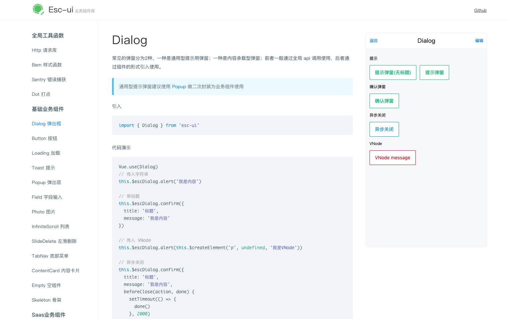

### Vue typescript component`s best practices

demo entry: [esc-ui](https://competent-bose-f6b47c.netlify.com/)



create one component
```
npm run create [component-name]
```

build one component
```
npm run build:one [component-name]
```

build all
```
npm run build
```

run demo
```
npm run docs
```

about ts

- [Typescript 入门梳理](https://github.com/Jmingzi/blog/blob/master/post/ts.md)
